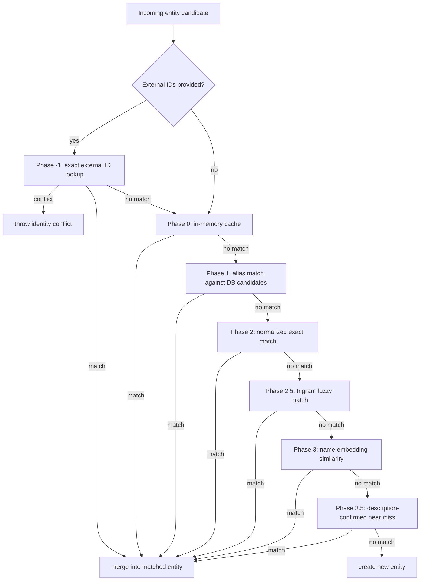
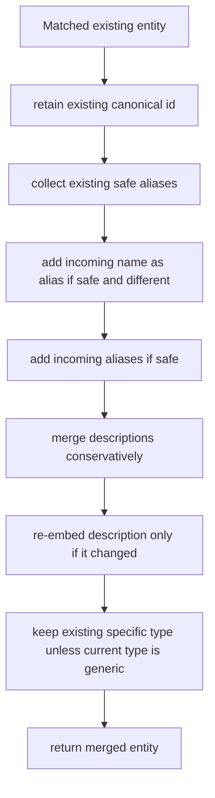

# Entity Resolution Flow

## Purpose

Entity resolution is the canonicalization layer between extraction output and stored graph identity.

Its job is to answer:

> Does this extracted entity already exist in scope, or should it create a new canonical entity?

This is the system that decides whether:

- `Adarsh`
- `Adarsh Tadimari`
- `Hi Adarsh`
- `Adarsh's`

are all one thing, multiple things, or partly garbage.

The resolver is conservative on purpose. A false merge corrupts the graph more severely than a missed merge.

## Inputs and Outputs

Input:

- candidate name
- candidate type
- candidate aliases
- scope identity
- optional description
- optional deterministic external IDs

Output:

- canonical entity
- `isNew` flag

Possible outcomes:

1. merge into an existing entity
2. create a new entity

## High-Level Strategy

Resolution is a cascade:

1. deterministic external ID checks first when available
2. cheap deterministic text checks next
3. stronger but more expensive similarity checks later
4. embeddings only when needed

The resolver does **not** immediately jump to vector similarity.

## Resolver Flow



## Scope

Resolution is always scoped by identity:

- `tenantId`
- `groupId`
- `userId`
- `agentId`
- `conversationId`

This prevents cross-tenant or otherwise invalid merges.

## Entity Type Contract

Entity types come from the central ontology registry in:

```txt
packages/sdk/src/index-engine/ontology.ts
```

Active entity types are:

```txt
person
organization
location
product
technology
concept
event
meeting
artifact
project
issue
role
law_regulation
time_period
creative_work
```

`artifact` is the graph entity type for authored business materials such as contracts, RFPs, specs, reports, decks, transcripts, and plans. TypeGraph ingested documents remain storage objects and chunks; they are not graph entities.

If a developer omits an entity type, TypeGraph uses the central default `concept`. Memory subjects with external IDs whose `identityType` is `user` default to `person`, which supports external-user memory flows where only an email address is known.

## Deterministic External IDs

External IDs are the strongest identity evidence TypeGraph supports.

They are structured, not bare strings:

```ts
interface ExternalId {
  id: string
  type: string
  identityType: 'tenant' | 'group' | 'user' | 'agent' | 'conversation' | 'entity'
  encoding?: 'none' | 'sha256'
  metadata?: Record<string, unknown>
}
```

Examples:

```ts
[
  { id: 'pat@example.com', type: 'email', identityType: 'user' },
  { id: 'U123', type: 'slack_user_id', identityType: 'user' },
  { id: 'pat-m', type: 'github_handle', identityType: 'user' },
]
```

External IDs are stored in `typegraph_entity_external_ids` and looked up by exact indexed normalized value.

Normalization examples:

- email-like identifiers are lowercased
- GitHub handles are lowercased
- phone numbers strip punctuation
- `encoding: 'sha256'` assumes the incoming id is already encoded and lowercases the hash

External IDs are scoped by the same identity fields as entity resolution:

- `tenantId`
- `groupId`
- `userId`
- `agentId`
- `conversationId`

They are identity-resolution anchors, not authorization credentials.

## External ID Conflict Rules

If an incoming external ID already belongs to an entity in scope, resolution uses that entity before fuzzy matching.

If a developer tries to attach the same scoped external ID to a different entity, the store rejects it. The resolver must not silently reassign deterministic identity.

This is intentional:

- deterministic identity should beat fuzzy extraction
- reassignment should be explicit
- accidental merges should fail loudly

## Developer Seeding

Developers can seed entities with deterministic identifiers:

```ts
await typegraph.graph.upsertEntity({
  name: 'Pat Example',
  entityType: 'person',
  externalIds: [
    { id: 'pat@example.com', type: 'email', identityType: 'user' },
    { id: 'U123', type: 'slack_user_id', identityType: 'user' },
  ],
})
```

They can then seed facts or edges using entity refs and external IDs. Entity resolution should prefer the external ID match before name similarity.

Memory subjects use the same shape:

```ts
await typegraph.remember('Prefers SMS for urgent notices', {
  tenantId: 'acme',
  subject: {
    externalIds: [{ id: 'pat@example.com', type: 'email', identityType: 'user' }],
    entityType: 'person',
  },
  visibility: 'tenant',
})
```

That flow resolves or upserts an entity, stores the memory, and links:

```txt
memory --ABOUT--> entity
```

via `typegraph_graph_edges`.

## Alias Safety Model

The resolver uses two different alias standards.

### Display-safe alias

This is the standard for storing aliases on the entity.

It asks:

- is this alias safe enough to show and persist?

### Strong alias for merge

This is the stricter standard used for identity matching.

It asks:

- is this alias strong enough to trust as merge evidence?

That distinction matters because an alias can be okay to display but still too weak to use as canonical merge evidence.

## Alias Validation

### `isValidAlias(...)`

Rejects aliases that are obviously bad:

- empty or 1-character
- over 80 chars
- greetings like `hi adarsh`
- imperatives like `inform adarsh`
- quantifiers like `both adarsh`
- possessives like `adarsh's`
- URLs/emails
- lowercase pronouns
- pure numbers
- disambiguator-style parentheticals
- bare generic noun phrases like `the team`
- generic one-word nouns like `finals`, `mvp`

### `isDisplayAliasSafe(...)`

Builds on `isValidAlias(...)`.

For person aliases it adds stricter rules:

- no sentence boundaries
- 1 to 5 tokens only
- no leading fragment words

### `isStrongAliasForMerge(...)`

Builds on `isDisplayAliasSafe(...)`.

For people it becomes even stricter:

- surname-only aliases are often rejected
- weak bare first-name aliases are rejected
- aliases that only match by a fragile surname pattern are rejected

This is one of the key protections against merging every `Adarsh`-like mention into the wrong person.

## Phase-by-Phase Behavior

## Phase -1: Exact external ID lookup

When external IDs are provided, the resolver asks the store for an exact scoped match using `findEntityByExternalId(...)`.

Behavior:

1. normalize each external ID
2. perform indexed lookup in `typegraph_entity_external_ids`
3. if one entity matches, use that entity
4. merge safe incoming name/type/alias/description data into the matched entity
5. if external IDs resolve to conflicting entities, throw
6. if none resolve, continue through normal text-based resolution

This phase is used by:

- developer entity seeding
- developer fact seeding with entity refs
- memory subject resolution
- query entity-scope resolution

It is not fuzzy and must remain cheap.

## Phase 0: In-memory cache

The resolver keeps a session-local map from normalized names and strong aliases to canonical entities.

Purpose:

- catch duplicates within the same ingest session
- avoid repeat DB lookups
- reduce timing-race duplicates across nearby triple writes

Behavior:

1. normalize incoming name
2. check cache by canonical name
3. check cache by incoming strong aliases
4. require type compatibility
5. if matched, merge immediately

This is the cheapest path.

## Phase 1: Alias match against DB candidates

If the store supports `findEntities(...)`, the resolver fetches likely text matches from the DB.

Then `findByAlias(...)` compares:

- incoming name + strong aliases
- candidate name + candidate strong aliases

All comparisons are done on normalized forms.

If any incoming normalized name matches any candidate normalized name or strong alias, the entity merges.

## Phase 2: Normalized exact match

This catches case and punctuation variants that are semantically identical.

Examples:

- `OpenAI` vs `openai`
- `J.K. Rowling` vs `JK Rowling`

This phase compares normalized canonical names and normalized strong aliases.

## Phase 2.5: Fuzzy trigram match

If exact normalized matching fails, the resolver tries trigram Jaccard similarity.

Purpose:

- catch abbreviations
- catch spacing/punctuation reorderings
- catch close textual variants

Examples:

- `NY Times` vs `New York Times`
- `JK Rowling` vs `J. K. Rowling`

This phase is guarded. It still requires:

- compatible types
- for people, non-weak merge evidence
- no conflicting distinguishers

Threshold:

- `FUZZY_THRESHOLD = 0.85`

## Phase 3: Name embedding similarity

If deterministic and fuzzy matching fail, the resolver embeds the incoming name and searches entity embeddings.

This is the first real semantic merge stage.

But it is still heavily guarded.

### Person-specific guards

For `person` entities, the resolver requires:

- matching last token when both names have 2+ tokens
- no weak person-name evidence

That means:

- `Adarsh Tadimari` and `Adarsh Revy` should not merge
- `Chris Mullin` and `Christopher Paul Mullin` may merge

### Cross-type guard

`typesCompatible(...)` prevents merges like:

- person into location
- organization into event

Fallback types are allowed to merge into more specific types when stronger evidence matches. This keeps developer-seeded or memory-created entities refinable without reintroducing `entity` as an extracted ontology type.

### Shared token guard

`hasSharedNameToken(...)` requires at least one meaningful shared token after stop-word removal.

Examples:

- `Chris Mullin` and `Christopher Paul Mullin` -> pass
- `United States` and `United Kingdom` -> fail because `united` is ignored

### Conflicting distinguisher guard

`hasConflictingDistinguishers(...)` blocks merges when names differ on:

- years
- versions
- ordinals
- opposing qualifiers

Examples:

- `Python 2` vs `Python 3` -> conflict
- `2023 NBA Finals` vs `2024 NBA Finals` -> conflict
- `Eastern Conference` vs `Western Conference` -> conflict
- `Senior Team` vs `Junior Team` -> conflict

Only if the candidate survives all those guards does cosine similarity decide the merge.

Default threshold:

- `similarityThreshold = 0.85`

## Phase 3.5: Description-confirmed near miss

This phase is used only if:

- name similarity is suggestive but below the direct merge threshold
- an incoming description exists
- candidate descriptions and description embeddings exist

Purpose:

- catch legitimate near misses where name form differs but semantic identity is likely the same

Thresholds:

- `NEAR_MISS_NAME_THRESHOLD = 0.45`
- `DESC_SIMILARITY_THRESHOLD = 0.8`

This phase still enforces:

- type compatibility
- person surname/weak-name guards
- no conflicting distinguishers
- shared meaningful name token

So it is not a free semantic merge. It is a guarded confirmation step.

## Create-New Path

If all phases fail:

1. embed the name if not already embedded
2. embed the description if one exists
3. create a new entity
4. cache it
5. return `isNew: true`

The created entity stores:

- canonical name
- type
- aliases
- properties.description
- name embedding
- optional description embedding
- scope
- temporal metadata

## Merge Path

If any phase matches, the resolver merges incoming data into the existing entity.



## Merge Rules In Detail

### Canonical identity stays stable

The existing entity id remains the canonical node.

The resolver does not rename ids on merge.

### Incoming canonical name may become an alias

If the incoming name differs from the stored canonical name, the incoming name may be added as an alias.

But only if it is display-safe.

### Incoming aliases are filtered again

No alias is trusted just because extraction produced it.

Incoming aliases are re-validated before they are stored.

### Type specificity is preserved

If the existing type is specific and the incoming type is generic, keep the existing specific type.

If the existing type is generic and the incoming type is specific, promote to the specific type.

### Description merge is conservative

Descriptions are not blindly concatenated anymore.

The merge path:

1. split descriptions into sentences
2. remove low-value description sentences
3. dedupe normalized sentences
4. append until max length
5. trim on a word boundary if needed

Cap:

- `MAX_DESCRIPTION_LENGTH = 1200`

## Low-Value Description Filtering

`isLowValueEntityDescription(...)` removes boilerplate like:

- creator of the task
- creator of the document
- assignee responsible
- primary contact and requester
- tagged in the
- copied on the
- for visibility

It also rejects very short role-only descriptions dominated by words like:

- creator
- assignee
- requester
- participant
- individual
- professional

This is one of the reasons repeated role spam should stop dominating entity descriptions.

## Different-Person Description Guard

`descriptionAppearsAboutDifferentPerson(...)` tries to avoid poisoning a person entity with a description that is clearly about someone related to them.

It looks for patterns like:

- `father of <existing name>`
- `partner of <existing name>`
- `cousin of <existing name>`

If such a pattern appears, the incoming description is not merged into the existing person.

## Person-Specific Merge Defenses

These are the main protections that keep people from collapsing incorrectly.

### `hasMatchingLastToken(...)`

If both names look like multi-token person names, the last token must match.

Examples:

- `Adarsh Tadimari` vs `Adarsh Revy` -> fail
- `Chris Mullin` vs `Christopher Paul Mullin` -> pass

### `hasWeakPersonNameMergeEvidence(...)`

Rejects weak patterns such as:

- surname-only weak matches
- single-token weak matches against a full multi-token name

This is the mechanism that prevents overly aggressive merges from names like `Adarsh`.

## Why Bad Aliases Like `Hi Adarsh` Should Stop Appearing

Those strings are blocked in multiple places:

1. extractor post-processing alias filtering
2. resolver `isValidAlias(...)`
3. resolver `isDisplayAliasSafe(...)`
4. resolver `isStrongAliasForMerge(...)`

That layered defense is intentional. Alias garbage is damaging both for:

- public graph exploration
- internal resolution accuracy

## Resolver Design Principles

The resolver follows these rules:

1. prefer deterministic evidence over embeddings
2. never silently reassign a scoped external ID
3. treat people as the highest-risk merge class
4. do not trust extracted aliases blindly
5. do not trust descriptions blindly
6. preserve canonical ids once chosen
7. allow generic -> specific type upgrades
8. block merges with distinguishers that indicate separate instances

## Public Entity Maintenance

Entity resolution handles automatic canonicalization at write time. Public graph maintenance handles deliberate corrections after the fact:

```ts
await typegraph.graph.mergeEntities({
  sourceEntityId: 'ent_duplicate',
  targetEntityId: 'ent_canonical',
  tenantId: 'acme',
})

await typegraph.graph.deleteEntity('ent_bad', {
  tenantId: 'acme',
  mode: 'invalidate',
})
```

### Merge

`mergeEntities` is transactional at the store layer.

It:

- moves source aliases, properties, and external IDs onto the target
- fails if a moved external ID conflicts with a third entity
- rewrites entity edges, typed graph edges, facts, entity chunk mentions, and memory/entity associations
- collapses duplicate facts and edges
- invalidates self-edges created by the merge
- marks the source entity as `status: 'merged'`, sets `mergedIntoEntityId`, and sets an invalidation timestamp

The target canonical id stays stable.

### Delete

`deleteEntity` supports:

- `mode: 'invalidate'`, the default
- `mode: 'purge'`

`invalidate` marks the entity inactive and invalidates associated graph/fact records while preserving provenance. `purge` physically removes the entity row and graph references. Neither mode deletes chunks, ingested documents, or memory records themselves.

Delete mode is called `invalidate`, not `tombstone`.

### External IDs During Maintenance

External IDs remain deterministic identity anchors. Merges may move them from source to target only when no third entity already owns the same scoped identifier. Deletes remove or invalidate entity references, but they do not convert external IDs into authorization credentials.

## Practical Mental Model

The resolver is not "find the nearest entity embedding".

It is:

1. try exact external identity evidence
2. try strong alias evidence
3. try normalized and fuzzy textual evidence
4. try semantic evidence under strict guards
5. otherwise create a new canonical node

That is the right way to think about why the graph can improve without collapsing every person with a common first name into the same node.
