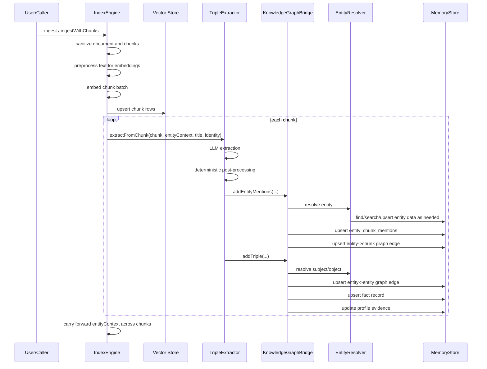
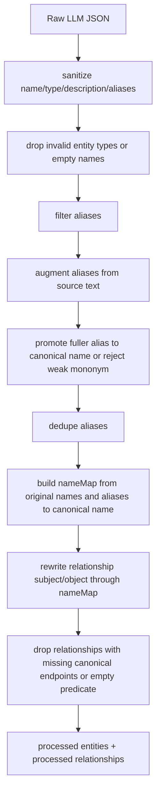

# Graph Extraction Flow

## Purpose

Graph extraction converts indexed text into durable graph and memory-compatible structures that support:

- entity exploration
- fact lookup
- graph-augmented chunk retrieval
- entity-scoped query
- entity-aware memory
- profile consolidation

The extraction system writes three classes of durable knowledge data:

1. canonical entities
2. canonical facts and entity-entity edges
3. entity-to-chunk graph edges

It also writes raw mention evidence:

1. `typegraph_entity_chunk_mentions`

Chunks are the only retrievable text unit. The graph no longer creates or manages passage nodes or passage-specific edge tables.

## Important Clarification: Does Post-Processing Add LLM Calls?

No.

Post-processing is deterministic TypeScript. It runs after the extractor receives JSON from the model.

LLM call count by extractor mode:

- `twoPass = true`:
  - 1 LLM call for entity extraction
  - 1 LLM call for relationship extraction
- `twoPass = false`:
  - 1 combined LLM call

Post-processing adds:

- zero extra LLM calls
- zero embedding calls by itself

Embedding calls happen later when:

- new entities need name embeddings
- descriptions need description embeddings
- new facts need fact embeddings

## Definitions

### Chunk

A stored piece of document text in the vector index.

Chunk identity is:

- `bucketId`
- `documentId`
- `chunkIndex`
- optional `embeddingModel`
- optional `chunkId`

### Entity

A canonical graph node representing a resolved typed thing from the central ontology.

Entities can come from extraction or from developer seeding.

Active entity types are:

```txt
person
organization
location
product
technology
concept
event
meeting
artifact
project
issue
role
law_regulation
time_period
creative_work
```

`artifact` is the graph entity type for authored business materials such as contracts, RFPs, specs, reports, decks, transcripts, and plans. TypeGraph ingested documents remain storage objects with `documentId`; they are not graph entity types.

### Fact

A persisted, normalized relation record derived from a canonical entity-entity semantic edge.

### Typed Graph Edge

`typegraph_graph_edges` stores traversable associations with typed endpoints:

- `entity -> entity`
- `entity -> chunk`
- `memory -> entity`

Supported node types:

- `entity`
- `chunk`
- `memory`

### Entity-Chunk Mention Evidence

`typegraph_entity_chunk_mentions` stores raw mention evidence:

- exact surface text
- normalized surface text
- mention type
- confidence
- chunk location

It is not the traversal hot path. Traversal uses aggregated typed graph edges.

## Central Ontology Registry

Ontology state lives in one SDK source of truth:

```txt
packages/sdk/src/index-engine/ontology.ts
```

That file owns:

- entity type specs
- canonical predicate specs
- predicate aliases
- inverse direction and swap metadata
- symmetric predicate metadata
- prompt grouping
- alias relation cues
- soft domain/range validation
- predicate normalization

Other extraction, query, normalization, and graph modules import derived helpers from the registry. Do not add local predicate lists or duplicated entity type lists elsewhere.

The canonical predicate vocabulary is compact on purpose:

- Core/taxonomy: `IS_A`, `PART_OF`, `CONTAINS`, `EQUIVALENT_TO`, `RELATED_TO`
- People/roles/orgs: `WORKS_FOR`, `WORKS_AS`, `REPORTS_TO`, `MANAGES`, `FOUNDED`, `LEADS`, `ADVISES`, `MEMBER_OF`, `REPRESENTS`, `INVESTED_IN`, `MARRIED`, `DIVORCED`, `PARENT_OF`, `CHILD_OF`, `SIBLING_OF`, `MENTORED`
- Business/org: `ACQUIRED`, `MERGED_WITH`, `PARTNERED_WITH`, `COMPETES_WITH`, `FUNDED`, `SUPPLIED`, `SUED`, `REGULATED_BY`, `OWNS`
- Product/technical: `USES`, `IMPLEMENTS`, `INTEGRATES_WITH`, `REQUIRES`, `COMPATIBLE_WITH`, `MIGRATED_FROM`, `DEPLOYED_AT`, `REPLACES`, `BASED_ON`
- Work/project/issue/artifact: `ASSIGNED_TO`, `BLOCKS`, `DUPLICATES`, `RESOLVES`, `CREATED`, `AUTHORED`, `SIGNED`, `APPROVED`, `REFERENCES`, `DESCRIBES`, `SUPPORTS`, `OPPOSES`
- Event/location/legal: `ATTENDED`, `ORGANIZED`, `SPOKE_AT`, `OCCURRED_AT`, `OCCURRED_IN`, `LOCATED_IN`, `OPERATES_IN`, `HEADQUARTERED_IN`, `GOVERNS`, `PROHIBITS`, `PERMITS`, `AMENDS`, `REPEALS`, `CAUSED`, `PRECEDED`, `FOLLOWED`
- Historical/narrative: `KILLED`, `BETRAYED`, `RESCUED`, `EXILED_TO`, `RULED`, `CONQUERED`, `IMPRISONED_IN`, `FOUGHT_IN`

Near-duplicates normalize into canonical predicates. For example, `WORKED_FOR` becomes `WORKS_FOR` with `temporalStatus: 'former'`, `CO_FOUNDED` becomes `FOUNDED`, and `WRITTEN_BY` becomes `AUTHORED` with subject/object swap.

Alias relation cues such as `KNOWN_AS`, `AKA`, `ALIAS`, and `CALLED` are not graph predicates. They are routed into entity aliases during graph writes. `NAMED_AFTER` and similar cues are rejected as graph predicates rather than materialized as claims.

## Removed Passage Model

The following are no longer created or managed:

- `typegraph_passage_nodes`
- `typegraph_passage_entity_edges`
- `KnowledgeGraphBridge.upsertPassageNodes`
- `searchGraphPassages`
- `getPassagesForEntity`

Existing legacy passage tables may remain in a database, but `typegraph.deploy` does not create them and does not drop them.

## End-to-End Ingestion and Extraction Order



## Step-by-Step Flow

### 1. Document and chunks are sanitized

The engine sanitizes:

- document fields
- chunk text
- chunk metadata

This happens before embedding and before extraction.

### 2. Chunk embeddings are created

The engine computes embeddings for all chunks that will be indexed.

These embeddings are used for:

- semantic retrieval
- dense chunk seeding during graph query

### 3. Chunk rows are persisted first

The chunk rows go into the vector-backed chunk table before graph extraction starts.

This ordering matters because graph retrieval reads chunk content from the vector adapter. The graph stores chunk refs, not chunk text.

### 4. Extraction runs chunk by chunk

The engine iterates chunks in order and calls:

```ts
TripleExtractor.extractFromChunk(...)
```

It passes forward `entityContext` built from earlier successful chunks in the same document.

### 5. Entity context is carried across chunks

`entityContext` is a bounded list of previously extracted canonical entities from the same document.

It helps later chunks avoid duplicate entity creation when they refer to earlier entities with:

- surname-only references
- abbreviations
- shortened forms
- pseudonyms

This is not global memory. It is per-document contextual carry-forward.

### 6. The extractor runs one-pass or two-pass LLM extraction

Current default:

- `twoPass = true`

That means:

1. entity extraction prompt runs first
2. relationship extraction prompt runs second using the extracted entity list

The second pass is constrained to entities from the first pass. This reduces arbitrary relationship endpoints.

### 7. Deterministic post-processing runs

After raw JSON returns, the extractor runs deterministic post-processing.



Post-processing handles:

- Unicode/control-character cleanup
- invalid entity type removal
- unsafe alias filtering
- source-text alias augmentation
- canonical-name promotion
- relationship endpoint rewriting

## Entity Mention Storage

When an entity mention is accepted, `KnowledgeGraphBridge.resolveAndStoreEntity(...)` does two separate writes.

### 1. Raw Mention Evidence

It writes one or more `typegraph_entity_chunk_mentions` rows.

These rows are detailed evidence:

- `entityId`
- `bucketId`
- `documentId`
- `chunkIndex`
- `mentionType`
- `surfaceText`
- `normalizedSurfaceText`
- `confidence`

Use this table for:

- debugging extraction
- alias learning
- provenance
- future backfills

Do not use it as the online traversal table.

### 2. Traversable Entity-to-Chunk Edge

It writes a typed graph edge:

```txt
entity --MENTIONED_IN--> chunk
```

The edge is stored in `typegraph_graph_edges` with:

- `source_type = 'entity'`
- `source_id = entityId`
- `target_type = 'chunk'`
- `target_id = chunk node id`
- `relation = 'MENTIONED_IN'`
- chunk ref columns for the chunk endpoint
- scope identity columns
- visibility
- evidence/properties

The properties include aggregated mention metadata such as:

- mention count
- confidence
- surface texts
- mention types

This edge is the durable bridge from entities to chunks for graph retrieval.

## Triple and Fact Storage

When a relationship is accepted, `KnowledgeGraphBridge.addTriple(...)`:

1. resolves subject entity
2. resolves object entity
3. normalizes predicate
4. routes alias cue predicates into entity aliases instead of graph edges
5. rejects generic or invalid predicates
6. soft-validates predicate domain/range
7. rejects self-edges
8. writes an entity-to-entity graph edge
9. writes a compact fact record
10. updates entity profile evidence

Soft domain/range validation rejects invalid predicates but does not hard-block plausible extracted or developer-seeded facts solely because entity types are imperfect. Mismatches are stored in edge properties as validation metadata and receive reduced weight.

Tense is metadata, not predicate identity. Use canonical predicates for both current and former facts, with `temporalStatus`, `validFrom`, and `validTo` carrying temporal meaning.

Entity-to-entity graph edges are stored in `typegraph_graph_edges` with:

- `source_type = 'entity'`
- `target_type = 'entity'`
- `relation`
- `weight`
- `properties`
- scope identity columns
- visibility
- evidence
- temporal columns

Fact records are stored in `typegraph_fact_records`. They support:

- vector search
- keyword search through `search_vector`
- source/target entity filtering
- graph query seeding
- direct fact results for semantic/keyword query
- invalidation through `invalid_at`

## Developer Seeding

Developers can seed:

- entities
- edges
- facts
- external IDs for entities

Seeded entities can include deterministic external IDs:

```ts
await typegraph.graph.upsertEntity({
  name: 'Pat Example',
  entityType: 'person',
  externalIds: [
    { id: 'pat@example.com', type: 'email', identityType: 'user' },
    { id: 'U123', type: 'slack_user_id', identityType: 'user' },
  ],
})
```

These external IDs are used before fuzzy/probabilistic matching during entity resolution.

## Storage Tables

### `typegraph_semantic_entities`

Canonical entities.

Important fields:

- `id`
- `name`
- `entity_type`
- `aliases`
- `properties`
- embeddings
- scope identity columns
- visibility
- temporal columns
- `status`
- `merged_into_entity_id`
- `deleted_at`

### `typegraph_entity_external_ids`

Deterministic entity identifiers.

Important fields:

- `entity_id`
- `identity_type`
- `type`
- `id_value`
- `normalized_value`
- `encoding`
- metadata
- scope identity columns

Lookups are exact and indexed. Query hot paths do not fuzzy-match external IDs.

### `typegraph_graph_edges`

Canonical typed graph edge table.

Important fields:

- `source_type`
- `source_id`
- `target_type`
- `target_id`
- `relation`
- `weight`
- `properties`
- `evidence`
- source chunk ref columns
- target chunk ref columns
- scope identity columns
- visibility
- temporal columns

Supported endpoint types:

- `entity`
- `chunk`
- `memory`

### `typegraph_entity_chunk_mentions`

Raw mention evidence table.

Important fields:

- `entity_id`
- `bucket_id`
- `document_id`
- `chunk_index`
- `mention_type`
- `surface_text`
- `normalized_surface_text`
- `confidence`

### `typegraph_fact_records`

Searchable fact records derived from entity-to-entity edges.

Important fields:

- `edge_id`
- `source_entity_id`
- `target_entity_id`
- `relation`
- `fact_text`
- `fact_search_text`
- embedding
- `search_vector`
- scope identity columns
- visibility
- `invalid_at`

### Legacy Orphaned Passage Tables

These may exist in older databases:

- `typegraph_passage_nodes`
- `typegraph_passage_entity_edges`

They are no longer created or managed by deploy. They are left orphaned and should not be used by current graph/query paths.

## Backfill

Graph backfill now creates:

- entity-to-chunk typed graph edges from `typegraph_entity_chunk_mentions`
- fact records from existing entity-to-entity semantic edges
- entity profile updates from fact evidence

Backfill result shape:

```ts
interface GraphBackfillResult {
  entityChunkEdgesUpserted: number
  factRecordsUpserted: number
  entityProfilesUpdated: number
  batches: number
}
```

Backfill no longer creates passage nodes.

## Entity-Aware Memory Integration

Memory records can be linked to entities through typed graph edges:

```txt
memory --ABOUT--> entity
```

`remember(...)` can accept a subject:

```ts
await typegraph.remember('Prefers SMS for urgent notices', {
  tenantId: 'acme',
  subject: {
    externalIds: [{ id: 'pat@example.com', type: 'email', identityType: 'user' }],
    entityType: 'person',
  },
  visibility: 'tenant',
})
```

The memory layer:

1. resolves/upserts the subject entity by external ID
2. stores the memory
3. writes a `memory -> entity` `ABOUT` edge

`forget(memoryId)` invalidates the memory and invalidates graph edges for that memory node.

`correct(...)` and conversation memory accept the same subject shape and constrain contradiction checks to the intended entity context when possible.

## Entity Maintenance

Public graph APIs now expose safe entity health operations:

```ts
await typegraph.graph.mergeEntities({
  sourceEntityId: 'ent_duplicate',
  targetEntityId: 'ent_canonical',
  tenantId: 'acme',
})

await typegraph.graph.deleteEntity('ent_bad', {
  tenantId: 'acme',
  mode: 'invalidate',
})
```

`mergeEntities` transactionally moves source aliases, properties, external IDs, facts, entity edges, typed graph edges, entity-chunk mentions, and memory/entity associations onto the target. It collapses duplicate records, invalidates self-edges created by the merge, and marks the source entity as `status: 'merged'` with `mergedIntoEntityId`.

`deleteEntity(..., { mode: 'invalidate' })` marks the entity invalid and invalidates associated facts/edges while preserving provenance. `mode: 'purge'` physically removes entity rows and graph references. Delete never removes chunks, ingested documents, or memory records themselves.

## Latency Guardrails

Extraction and query performance depend on these invariants:

- chunk content stays in the vector adapter
- graph edges store chunk refs, not chunk content
- external ID lookup is exact and indexed
- graph traversal reads `typegraph_graph_edges`, not raw mention rows
- chunk filtering uses `(bucket_id, document_id, chunk_index)`
- direct semantic/keyword knowledge search does not fetch chunk content

## Cloud Backend Checklist

Cloud backend implementation needs to mirror the SDK behavior:

- stop creating managed passage tables
- leave legacy passage tables orphaned
- create and query `typegraph_graph_edges`
- support typed endpoints for `entity`, `chunk`, and `memory`
- store chunk ref columns for chunk endpoints
- mirror the central ontology registry and avoid duplicated predicate/type lists
- expose entity external ID upsert/lookup APIs
- expose transactional `mergeEntities` and `deleteEntity` APIs
- expose `getChunksForEntity`, not `getPassagesForEntity`
- implement `resolveEntityScope`
- implement direct `searchKnowledge`
- implement `searchGraphChunks`
- link memory records to entities through `memory -> entity` graph edges
- invalidate memory-origin graph edges on forget
