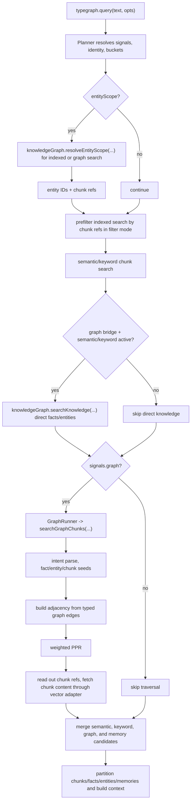
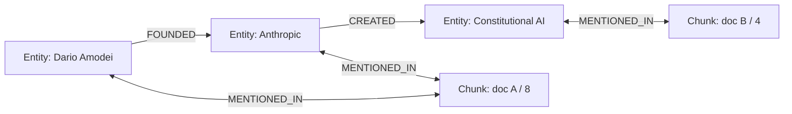

# Graph Query Flow

## Purpose

TypeGraph has four retrieval signals that answer different questions:

- Semantic search: "Which chunks look similar to the query embedding?"
- Keyword search: "Which chunks contain the lexical terms?"
- Memory search: "Which memories are relevant to this interaction?"
- Graph search: "Which chunks are connected to the entities and facts implied by this query?"

The current graph query path runs over a heterogeneous graph, but chunks are now the only retrievable text unit. There are no managed passage nodes and no passage result APIs.

The graph contributes:

- entity nodes for canonical identity and traversal
- fact records for high-precision query anchoring
- typed graph edges for entity-to-entity, entity-to-chunk, and memory-to-entity associations
- chunk refs for the final readout into the vector adapter's chunk table

The caller receives ranked chunks, facts, entities, memories, and optional formatted context.

## Public API Shape

Graph-backed retrieval is part of the unified query API:

```ts
const response = await typegraph.query('Who founded Anthropic?', {
  signals: { semantic: true, keyword: true, graph: true },
  graphReinforcement: 'prefer',
  context: {
    format: 'xml',
    sections: ['chunks', 'facts', 'entities'],
    maxTotalTokens: 6000,
  },
})

console.log(response.results.chunks)
console.log(response.results.facts)
console.log(response.results.entities)
console.log(response.context)
```

Graph inspection methods are still available, but they serve a different purpose:

```ts
await typegraph.graph.searchFacts('Anthropic founded by', { tenantId, limit: 10 })
await typegraph.graph.searchEntities('Anthropic', { tenantId }, { limit: 5 })
await typegraph.graph.explainQuery('Who founded Anthropic?', { tenantId })
await typegraph.graph.explore('Who founded Anthropic?', {
  tenantId,
  include: { entities: true, facts: true, chunks: true },
  explain: true,
})
await typegraph.graph.getChunksForEntity('ent_anthropic', { tenantId, limit: 10 })
```

Use `query(..., { signals: { graph: true } })` when the product needs retrieval results, answer context, or the graph evidence selected for a query.

Use `graph.explore(...)` to inspect graph state, anchors, facts, and relationship settings. It is not the graph retrieval path used by `query()`.

## Query vs Explore

| API | Main Question | Return Shape | Uses PPR? |
| --- | --- | --- | --- |
| `typegraph.query(..., { signals.graph: true })` | Which chunks should I give an LLM? | `results.chunks`, `results.facts`, `results.entities`, optional `context` | Yes |
| `typegraph.graph.explore(...)` | What does the graph know around this relationship question? | parsed intent, anchors, entities, facts, optional chunks, optional trace | No |

## Core Concepts

### Entity

A canonical node representing a resolved typed thing from the central ontology.

Entities can be created by extraction, seeded by developers, or resolved/upserted from deterministic external IDs.

Active entity types are:

```txt
person
organization
location
product
technology
concept
event
meeting
artifact
project
issue
role
law_regulation
time_period
creative_work
```

`artifact` is used for extracted business materials. TypeGraph ingested documents are storage records and chunks, not graph entities.

### Chunk

A stored piece of document text in the vector adapter. Chunks are the only text readout surface for query results.

Chunk identity is:

- `bucketId`
- `documentId`
- `chunkIndex`
- optional `embeddingModel`
- optional stable `chunkId`

### Chunk Ref

A lightweight pointer to a chunk:

```ts
interface ChunkRef {
  bucketId: string
  documentId: string
  chunkIndex: number
  embeddingModel?: string
  chunkId?: string
}
```

Graph APIs use chunk refs for filtering and readout, but the vector adapter owns chunk content retrieval.

### Fact

A persisted, structured record derived from a canonical semantic edge.

It is:

- directional
- normalized
- compact
- searchable by embedding and keyword

Example:

```txt
Dario Amodei co-founded Anthropic
```

Facts link the query into the graph with higher precision than raw chunk similarity.

### Typed Graph Edge

`typegraph_graph_edges` stores traversable graph associations with typed endpoints:

- `entity -> entity`, for semantic relationships
- `entity -> chunk`, for evidence-bearing mentions
- `memory -> entity`, for entity-aware memory

Supported node types:

- `entity`
- `chunk`
- `memory`

Entity-to-chunk traversal is just a regular typed graph edge, for example:

```txt
entity --MENTIONED_IN--> chunk
```

Memory-to-entity association is also a regular typed graph edge:

```txt
memory --ABOUT--> entity
```

### Entity-Chunk Mention Evidence

`typegraph_entity_chunk_mentions` is still written during extraction, but it is raw evidence, not the online traversal table.

It stores:

- exact surface text
- normalized surface text
- mention type
- confidence
- chunk location

It is useful for alias learning, debugging, provenance, and backfill. Traversal hot paths use aggregated `typegraph_graph_edges`.

## Ontology Contract

The graph query path consumes the same centralized ontology registry used by extraction and graph writes:

```txt
packages/sdk/src/index-engine/ontology.ts
```

The registry exports the canonical predicates, aliases, inverse direction metadata, symmetric predicates, alias cues, and soft domain/range validation helpers. Query intent parsing must not maintain its own predicate vocabulary. Deterministic query patterns may emit canonical predicates or known aliases, but every predicate is normalized through the registry before it reaches graph search.

`IS_A` is the classification predicate. `WORKS_AS` is for employment title, job, function, or role relationships. Former/current tense is represented as metadata on stored facts and edges, not separate predicates such as `WORKED_FOR` or `LED`.

Alias cues such as `KNOWN_AS`, `AKA`, `ALIAS`, and `CALLED` are not traversable claims. They improve entity resolution and stored aliases instead of becoming graph edges or searchable facts.

## Entity-Scoped Querying

Queries can be scoped to TypeGraph entity IDs or deterministic external IDs:

```ts
await typegraph.query('urgent notices', {
  entityScope: {
    entityIds: ['ent_pat'],
    externalIds: [
      { id: 'pat@example.com', type: 'email', identityType: 'user' },
      { id: 'U123', type: 'slack_user_id', identityType: 'user' },
    ],
    mode: 'filter',
  },
})
```

Shape:

```ts
interface QueryEntityScope {
  entityIds?: string[]
  externalIds?: ExternalId[]
  mode?: 'filter' | 'boost'
}
```

`ExternalId` is structured:

```ts
interface ExternalId {
  id: string
  type: string
  identityType: 'tenant' | 'group' | 'user' | 'agent' | 'conversation' | 'entity'
  encoding?: 'none' | 'sha256'
  metadata?: Record<string, unknown>
}
```

Multiple `entityIds` and `externalIds` use OR semantics. The scope matches information associated with any resolved entity.

### Filter Mode

Default mode is `filter`.

Behavior:

- resolves external IDs to entity IDs by exact indexed lookup
- resolves entity IDs to direct chunk refs through `entity -> chunk` graph edges
- prefilters vector/keyword chunk search by `ChunkFilter.chunkRefs`
- filters direct facts/entities to direct associations with any scoped entity
- filters memory recall to memories linked to any scoped entity

If no external IDs resolve, scoped results are empty and a warning can be returned.

### Boost Mode

Boost mode keeps normal results and boosts/includes direct scoped associations.

Behavior:

- normal vector/keyword search still runs
- scoped chunk refs get a small score boost
- direct scoped facts/entities can still be included

### No-Graph Behavior

TypeGraph still works without a graph configured:

- semantic and keyword query remain chunk-only
- basic memory still works
- memory-only `entityScope` can work if the memory store supports external-ID resolution and memory-to-entity lookup

Indexed `entityScope` requires graph-side scope resolution because chunks need graph-derived chunk refs before vector/keyword ranking. If a caller asks for indexed scoped search without a graph bridge that implements `resolveEntityScope`, TypeGraph throws `ConfigError`.

## Default Graph Profile

When `signals.graph` is enabled, `GraphRunner` defaults to the `fact-filtered-narrow` profile.

```ts
type GraphSearchProfile = 'fact-filtered-narrow'

interface GraphSearchOpts {
  profile?: GraphSearchProfile
}
```

The profile currently resolves to:

```ts
{
  factFilter: true,
  factCandidateLimit: 80,
  factFilterInputLimit: 12,
  factSeedLimit: 4,
  chunkSeedLimit: 80,
  maxExpansionEdgesPerEntity: 25,
  factChainLimit: 2,
  maxPprIterations: 40,
  minPprScore: 1e-8,
}
```

Explicit graph options override profile values:

```ts
await typegraph.query('relationship question', {
  signals: { semantic: true, graph: true },
  graph: {
    profile: 'fact-filtered-narrow',
    chunkSeedLimit: 120,
    maxExpansionEdgesPerEntity: 10,
  },
})
```

## End-to-End Query Flow



## Direct Knowledge Search Without Traversal

When semantic or keyword search is active and a graph bridge is configured, the planner calls:

```ts
knowledgeGraph.searchKnowledge(query, identity, {
  count,
  signals,
  entityScope,
  resolvedEntityIds,
})
```

This returns direct facts and entities for the query. It does not run PPR and does not fetch chunk content.

This is how semantic-only and keyword-only queries can return:

- chunks from vector/keyword search
- facts from fact semantic/keyword search
- entities from entity semantic/keyword search

Traversal remains exclusive to `signals.graph`.

## Graph Traversal Flow

`searchGraphChunks(...)` performs graph traversal.

### 1. Parse Graph Intent

The bridge parses the query to identify relationship-oriented intent. If no graph intent is found, graph traversal returns empty results.

### 2. Build Embeddings

The bridge builds embeddings for:

- fact search text
- chunk search text

When they are identical, the embedding is reused.

### 3. Retrieve Fact Candidates

Fact candidates are searched by embedding. If a fact relevance filter is configured, it can narrow the selected fact ids.

### 4. Build Seeds

Seeds can include:

- scoped entity seeds from `entityScope`
- intent anchor entities
- selected fact source and target entities
- dense chunk seeds from chunk embedding search

### 5. Assemble Heterogeneous Adjacency

The in-memory traversal graph includes:

- entity-to-entity graph edges
- entity-to-chunk graph edges
- mirrored chunk-to-entity edges



### 6. Run Weighted PPR

The bridge runs weighted Personalized PageRank with:

- adjacency
- seed weights
- restart probability
- iteration cap
- minimum score

### 7. Read Out Chunks

After PPR, the bridge keeps chunk nodes. Chunk refs are sorted by graph score and fetched through `memoryStore.getChunksByRefs(...)`, which joins against the vector adapter's chunk table.

The graph bridge does not own chunk content.

### 8. Merge With Other Signals

`GraphRunner` converts graph chunks into retrieval candidates. The planner merges graph, semantic, keyword, and memory candidates by stable chunk identity:

```txt
bucketId + documentId + chunkIndex
```

## Trace Fields

`typegraph.graph.explainQuery(query, opts)` runs the same graph chunk search used by the graph signal and returns trace metadata.

Important fields:

- `intent`
- `parser`
- `entitySeedCount`
- `factSeedCount`
- `chunkSeedCount`
- `graphNodeCount`
- `graphEdgeCount`
- `pprNonzeroCount`
- `candidatesBeforeMerge`
- `candidatesAfterMerge`
- `topGraphScores`
- `selectedFactIds`
- `selectedEntityIds`
- `selectedChunkIds`
- `finalChunkIds`
- `selectedFactTexts`
- `selectedEntityNames`
- `selectedFactChains`

## Latency Guardrails

Query latency depends on keeping scope and chunk operations exact and indexed:

- external ID resolution is exact lookup only
- external IDs are resolved once per query
- resolved entity IDs are deduped
- entity status/invalidity filters should be applied before traversal or direct fact search
- chunk filtering happens before vector/keyword ranking through `ChunkFilter.chunkRefs`
- pgvector has an index on `(bucket_id, document_id, chunk_index)`
- graph traversal reads aggregated `typegraph_graph_edges`, not raw mention rows
- graph APIs never fetch chunk content for direct knowledge search

## Backend Integration Notes

Cloud backend implementations need to expose/update:

- ontology registry parity with SDK canonical entity types, predicates, aliases, symmetric metadata, and validation behavior
- `POST /v1/graph/entities/:id/chunks` for `getChunksForEntity`
- `POST /v1/graph/entities/merge` for transactional entity merges
- `DELETE /v1/graph/entities/:id` with `mode: 'invalidate' | 'purge'`
- graph query execution backed by `searchGraphChunks`, not passage APIs
- direct knowledge search for semantic/keyword query paths
- entity scope resolution from structured external IDs
- typed graph edge storage and traversal over `entity`, `chunk`, and `memory`
- status-aware entity/fact/edge filters for invalidated and merged entities

Cloud APIs should remove or replace old passage endpoints rather than proxying them to chunks.
